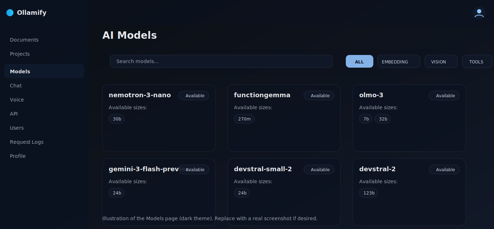

<h1 align="center">
  
  
  Ollamify
</h1>

<p align="center">
  <b>English</b> · <a href="README.ru.md">Русский</a>
</p>

<p align="center">
  Self-hosted AI gateway for developers — RAG, OpenAI-compatible API, TTS/STT, local Ollama + OpenRouter routing.
</p>

<p align="center">
  <a href="docs/README.md">Docs</a> ·
  <a href="docs/api/README.md">API</a> ·
  <a href="docs/ui/README.md">UI guide</a> ·
  <a href="docs/architecture.md">Architecture</a> ·
  <a href="docs/configuration.md">Configuration</a> ·
  <a href="docs/troubleshooting.md">Troubleshooting</a>
</p>

## Contents

- [Overview](#overview)
- [Features](#features)
- [Screenshot](#screenshot)
- [Model routing](#model-routing-local-ollama-vs-openrouter)
- [Quickstart](#quickstart)
- [How to use (first steps)](#how-to-use-first-steps)
- [Documentation](#documentation)

## Overview

Ollamify is a self‑hosted **AI gateway** for developers: deploy it locally (or run it as your own SaaS) and integrate AI into your products via a single, stable API.

## Features

It provides production‑ready building blocks out of the box:
- **RAG over documents** (ingestion → hybrid retrieval → optional rerank → answer)
- **Text generation** (including an **OpenAI‑compatible** Chat Completions endpoint)
- **Speech**: **TTS** (text → speech) and **STT** (speech → text)
- **Model routing**:
  - local models via **Ollama**
  - proxied models via **OpenRouter** (by using `openrouter/...` model names)
- **Multi-tenant access control**: users + API keys (one Ollamify instance can serve multiple apps)
- **Web UI** to manage projects/models/users and to test everything in a chat

## Screenshot



For architecture details: [`docs/architecture.md`](docs/architecture.md)

## Model routing (local Ollama vs OpenRouter)

You choose the provider **per request**:

- **Local (Ollama)**: send a normal model name, for example:
  - `model: "llama3.1:8b"`
- **Proxy (OpenRouter)**: prefix with `openrouter/`, for example:
  - `model: "openrouter/anthropic/claude-3.5-sonnet"`

This works for:
- `POST /api/ai/rag`
- `POST /api/v1/chat/completions` (OpenAI-compatible)

See: [`docs/api/README.md`](docs/api/README.md)

## Quickstart

### 1) Configure environment

Copy the example file and edit it:

```bash
cp .env_example .env
```

Minimum required for local run:
- `POSTGRES_USER`, `POSTGRES_PASSWORD`, `POSTGRES_DB`
- `JWT_SECRET`

Optional:
- `OPENROUTER_API_KEY`, `OPENROUTER_URL` (only if you want OpenRouter models)

### 2) Start (CPU or GPU)

**Linux/macOS/WSL/Git Bash** (recommended, auto GPU detection):

```bash
./start.sh
# force CPU mode
./start.sh --cpu
```

**Windows (PowerShell)**:

```powershell
docker compose up -d
# GPU mode
docker compose -f docker-compose.yml -f docker-compose.gpu.yml up -d
```

### 3) Open the UI

- **Web UI**: `http://localhost`
- **Default credentials (dev)**: `admin@example.com` / `admin`

## How to use (first steps)

- **Create a project**: UI → Projects → New Project
  - Choose an **embedding model** (the model must be available in Ollama)
- **Upload documents**: UI → Documents → Upload (or paste text)
  - Watch `loaded_chunks / total_chunks` to see indexing progress
- **Chat with your docs**: UI → Chat
  - Select a project, model, and toggle hybrid search / reranker if needed

## Documentation

- **Docs index**: [`docs/README.md`](docs/README.md)
- **API docs (pre-install friendly)**: [`docs/api/README.md`](docs/api/README.md)
- **UI guide**: [`docs/ui/README.md`](docs/ui/README.md)
- **Configuration**: [`docs/configuration.md`](docs/configuration.md)
- **Architecture**: [`docs/architecture.md`](docs/architecture.md)
- **Troubleshooting**: [`docs/troubleshooting.md`](docs/troubleshooting.md)

