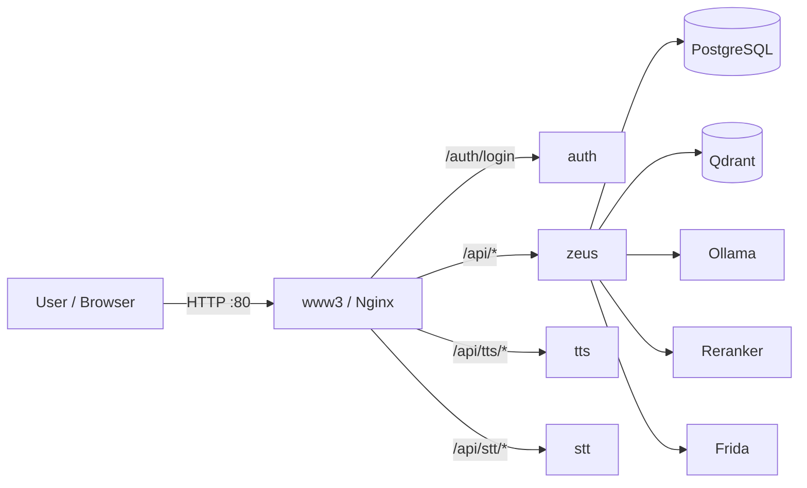

# Ollamify

**Language:** **English** | [Русский](README.ru.md)

Ollamify is a self-hosted **RAG (Retrieval-Augmented Generation)** stack: upload documents, search (hybrid vectors + keywords), and chat with LLMs — with optional **voice** (TTS/STT).

It ships as a Docker-first, multi-service setup with a web UI and an external API (including an OpenAI-compatible endpoint).

## High-level architecture



For details: [`docs/architecture.md`](docs/architecture.md)

## What’s included

- **Web UI** (served by `www3` / Nginx): documents, chat, projects, models, users/API keys, request logs, voice.
- **RAG backend** (`zeus`): projects, ingestion, embeddings via Ollama, Qdrant vector search, hybrid search, optional reranking.
- **Auth gateway** (`auth` + Nginx `auth_request`): JWT for UI + API keys for external usage.
- **LLM runtime**: local **Ollama** (optionally OpenRouter).
- **Vector DB**: **Qdrant**.
- **Speech**:
  - **TTS**: Silero TTS (RU voices)
  - **STT**: OpenAI Whisper

## Quickstart

### 1) Configure environment

Copy the example file and edit it:

```bash
cp .env_example .env
```

Minimum required for local run:
- `POSTGRES_USER`, `POSTGRES_PASSWORD`, `POSTGRES_DB`
- `JWT_SECRET`

Optional:
- `OPENROUTER_API_KEY`, `OPENROUTER_MODEL`, `OPENROUTER_URL` (only if you want OpenRouter models)

### 2) Start (CPU or GPU)

**Linux/macOS/WSL/Git Bash** (recommended, auto GPU detection):

```bash
./start.sh
# force CPU mode
./start.sh --cpu
```

**Windows (PowerShell)**:

```powershell
docker compose up -d
# GPU mode
docker compose -f docker-compose.yml -f docker-compose.gpu.yml up -d
```

### 3) Open the UI

- **Web UI**: `http://localhost`
- **Default credentials (dev)**: `admin@example.com` / `admin`

## How to use (first steps)

- **Create a project**: UI → Projects → New Project
  - Choose an **embedding model** (the model must be available in Ollama)
- **Upload documents**: UI → Documents → Upload (or paste text)
  - Watch `loaded_chunks / total_chunks` to see indexing progress
- **Chat with your docs**: UI → Chat
  - Select a project, model, and toggle hybrid search / reranker if needed

## Documentation

- **Docs index**: [`docs/README.md`](docs/README.md)
- **API docs (pre-install friendly)**: [`docs/api/README.md`](docs/api/README.md)
- **OpenAPI / Swagger (entry)**: [`docs/openapi.md`](docs/openapi.md)
- **UI guide**: [`docs/ui/README.md`](docs/ui/README.md)
- **Configuration**: [`docs/configuration.md`](docs/configuration.md)
- **Architecture**: [`docs/architecture.md`](docs/architecture.md)
- **Troubleshooting**: [`docs/troubleshooting.md`](docs/troubleshooting.md)

## Local endpoints (by default)

| Service | URL | Notes |
|---|---|---|
| Web UI (Nginx) | `http://localhost` | Main entrypoint |
| External API docs (Swagger UI) | `http://localhost/api/docs` | External/public OpenAPI |
| Qdrant | `http://localhost:6333` | Also has dashboard at `/dashboard` |
| TTS (direct) | `http://localhost:8003` | FastAPI docs at `/docs` |
| STT (direct) | `http://localhost:8004` | Flasgger UI typically at `/apidocs/` |
| Reranker | `http://localhost:8001/health` | Used by Zeus for reranking |
| Frida | `http://localhost:8002/health` | Embeddings-related service |

> Most API calls are designed to go through the gateway prefix **`/api`** (see OpenAPI docs).

## Notes on authentication

- **Web UI login**: `POST /auth/login` returns a JWT (`{ token }`)
- **External API**: send `Authorization: Bearer <JWT or API_KEY>`
- API keys are managed from the UI (Users → API keys).

## Repository layout

- `docker-compose.yml` / `docker-compose.gpu.yml`: stack definition
- `services/www3`: Nginx + UI
- `services/zeus`: main API backend + OpenAPI generator
- `services/auth`: auth service (JWT + API keys)
- `services/tts`, `services/stt`: voice services
- `services/vector-db`: Qdrant image/config
- `services/ollama`: Ollama bootstrap

