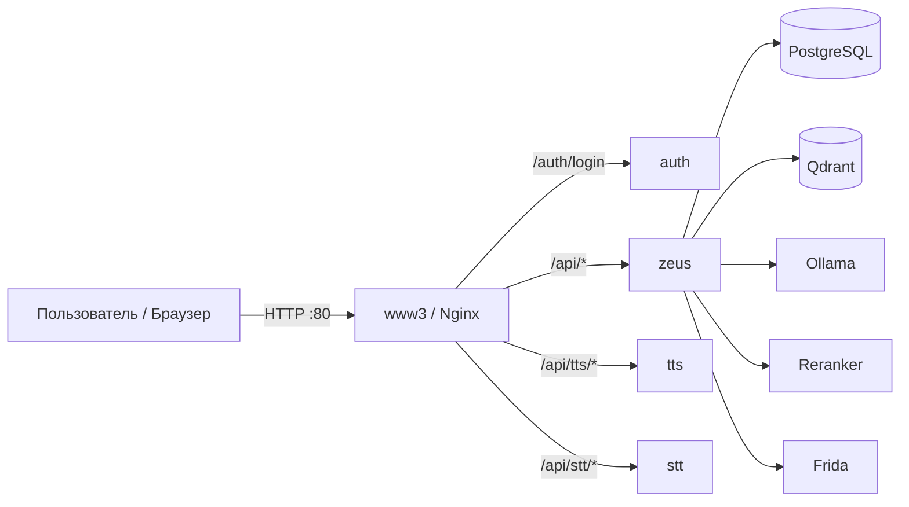

# Ollamify

[English](README.md) | **Русский**

Ollamify — это self-hosted стек для **RAG (Retrieval‑Augmented Generation)**: загрузка документов, поиск (гибрид: вектора + ключевые слова) и чат с LLM — с опциональным **голосом** (TTS/STT).

Проект поставляется как Docker‑ориентированная мультисервисная система с веб‑интерфейсом и внешним API (включая OpenAI‑совместимый эндпоинт).

## Архитектура (высокий уровень)



Подробнее: [`docs/architecture.ru.md`](docs/architecture.ru.md)

## Что внутри

- **Web UI** (через `www3` / Nginx): документы, чат, проекты, модели, пользователи/API‑ключи, логи запросов, голос.
- **RAG backend** (`zeus`): проекты, загрузка/индексация, эмбеддинги через Ollama, поиск в Qdrant, гибридный поиск, опциональный реранкер.
- **Auth gateway** (`auth` + Nginx `auth_request`): JWT для UI + API‑ключи для внешнего доступа.
- **LLM runtime**: локальный **Ollama** (опционально OpenRouter).
- **Vector DB**: **Qdrant**.
- **Speech**:
  - **TTS**: Silero TTS (русские голоса)
  - **STT**: OpenAI Whisper

## Быстрый старт

### 1) Настройка окружения

Скопируйте пример и отредактируйте:

```bash
cp .env_example .env
```

Минимально нужно для локального запуска:
- `POSTGRES_USER`, `POSTGRES_PASSWORD`, `POSTGRES_DB`
- `JWT_SECRET`

Опционально:
- `OPENROUTER_API_KEY`, `OPENROUTER_MODEL`, `OPENROUTER_URL` (если хотите OpenRouter)

### 2) Запуск (CPU или GPU)

**Linux/macOS/WSL/Git Bash** (рекомендуется, авто‑детект GPU):

```bash
./start.sh
# принудительно CPU
./start.sh --cpu
```

**Windows (PowerShell)**:

```powershell
docker compose up -d
# GPU режим
docker compose -f docker-compose.yml -f docker-compose.gpu.yml up -d
```

### 3) Откройте UI

- **Web UI**: `http://localhost`
- **Дефолтные учётные данные (dev)**: `admin@example.com` / `admin`

## Как пользоваться (первые шаги)

- **Создайте проект**: UI → Projects → New Project
  - Выберите **embedding‑модель** (модель должна быть доступна в Ollama)
- **Загрузите документы**: UI → Documents → Upload (или вставьте текст)
  - Прогресс индексации видно по `loaded_chunks / total_chunks`
- **Чат с документами**: UI → Chat
  - Выберите проект, модель и при необходимости включите гибридный поиск / реранкер

## Документация

- **Оглавление**: [`docs/README.ru.md`](docs/README.ru.md)
- **Документация API (удобно до установки)**: [`docs/api/README.ru.md`](docs/api/README.ru.md)
- **OpenAPI / Swagger (вход)**: [`docs/openapi.ru.md`](docs/openapi.ru.md)
- **UI гайд**: [`docs/ui/README.ru.md`](docs/ui/README.ru.md)
- **Конфигурация**: [`docs/configuration.ru.md`](docs/configuration.ru.md)
- **Архитектура**: [`docs/architecture.ru.md`](docs/architecture.ru.md)
- **Troubleshooting**: [`docs/troubleshooting.ru.md`](docs/troubleshooting.ru.md)

## Локальные эндпоинты (по умолчанию)

| Сервис | URL | Примечания |
|---|---|---|
| Web UI (Nginx) | `http://localhost` | Основной вход |
| Внешняя Swagger UI | `http://localhost/api/docs` | External/public OpenAPI |
| Qdrant | `http://localhost:6333` | Dashboard: `/dashboard` |
| TTS (напрямую) | `http://localhost:8003` | FastAPI docs: `/docs` |
| STT (напрямую) | `http://localhost:8004` | Flasgger UI обычно `/apidocs/` |
| Reranker | `http://localhost:8001/health` | Используется Zeus |
| Frida | `http://localhost:8002/health` | Сервис эмбеддингов |

> Большинство API запросов предполагают gateway‑префикс **`/api`** (см. OpenAPI).

## Про аутентификацию

- **Логин в UI**: `POST /auth/login` возвращает JWT (`{ token }`)
- **Внешний API**: `Authorization: Bearer <JWT или API_KEY>`
- API‑ключи управляются в UI (Users → API keys).

