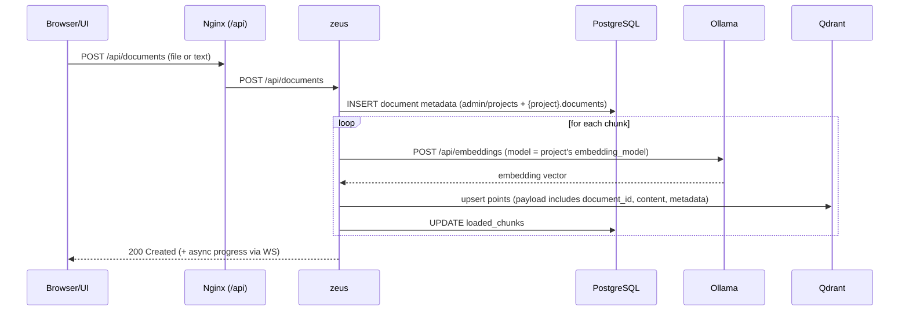
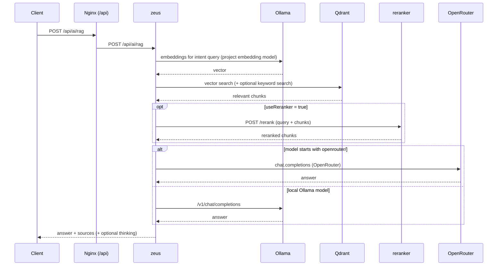

# Architecture

**Language:** **English** | [Русский](architecture.ru.md)

## System diagram (GitHub-rendered)

```mermaid
flowchart LR
  user[User / Browser] -->|HTTP :80| nginx[www3 / Nginx (UI + /api gateway)]

  nginx -->|POST /auth/login| auth[auth service]
  nginx -->|/api/* (protected)| zeus[zeus API]
  nginx -->|/api/tts/* (protected)| tts[tts service]
  nginx -->|/api/stt/* (protected)| stt[stt service]
  nginx -->|/ws/* (WebSocket)| zeus

  zeus -->|SQL| pg[(PostgreSQL)]
  zeus -->|REST :6333| qdrant[(Qdrant)]
  zeus -->|HTTP :11434| ollama[Ollama]
  zeus -->|HTTP :8001| reranker[Reranker]
  zeus -->|HTTP :8002| frida[Frida]
```

## High-level view

- `www3` (Nginx) is the **single entry point** for the UI and the `/api` gateway.
- `auth` verifies JWT / API keys (via Nginx `auth_request`).
- `zeus` is the main backend: projects, documents, RAG, model management, OpenAPI generation.
- `ollama` provides local LLM + embeddings runtime.
- `vector-db` runs Qdrant (vector search).
- `db` is PostgreSQL (+ pgvector extension; admin tables are in `admin` schema).
- `tts` and `stt` are separate services exposed under `/api/tts/*` and `/api/stt/*`.

## Ports (default)

| Service | Container port | Host port |
|---|---:|---:|
| www3 (Nginx) | 80 | 80 |
| zeus | 80 | (internal) |
| auth | 80 | (internal) |
| db (Postgres) | 5432 | (internal) |
| vector-db (Qdrant) | 6333 | 6333 |
| frida | 8002 | 8002 |
| reranker | 8001 | 8001 |
| tts | 8003 | 8003 |
| stt | 8004 | 8004 |

## Gateway routing (Nginx)

- `POST /auth/login` → `auth`
- `/api/*` → `zeus` (authenticated)
- `/api/tts/*` → `tts` (authenticated)
- `/api/stt/*` → `stt` (authenticated)
- `/api/docs` → `zeus` (public Swagger UI)

## Key flows

### Document ingestion (upload → chunks → embeddings → Qdrant)



### RAG request (hybrid retrieval → optional rerank → answer)




