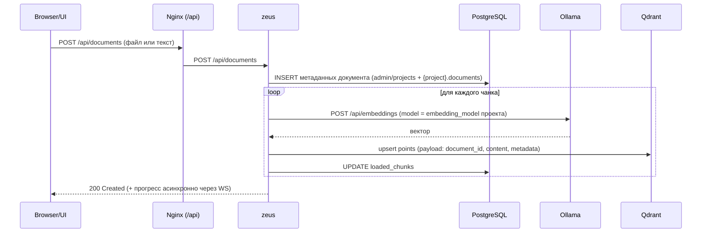
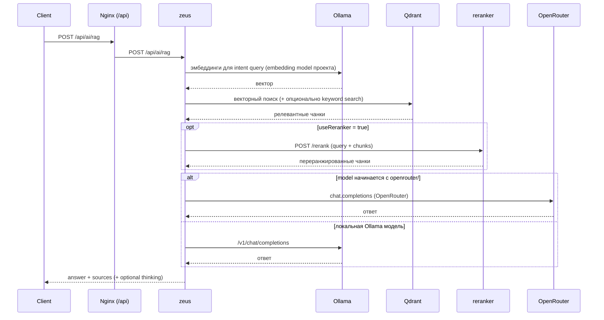

# Архитектура

[English](architecture.md) | **Русский**

## Схема системы (рендерится прямо в GitHub)

```mermaid
flowchart LR
  user[Пользователь / Браузер] -->|HTTP :80| nginx[www3 / Nginx (UI + /api gateway)]

  nginx -->|POST /auth/login| auth[auth service]
  nginx -->|/api/* (защищено)| zeus[zeus API]
  nginx -->|/api/tts/* (защищено)| tts[tts service]
  nginx -->|/api/stt/* (защищено)| stt[stt service]
  nginx -->|/ws/* (WebSocket)| zeus

  auth -->|SQL| pg[(PostgreSQL)]
  zeus -->|SQL| pg[(PostgreSQL)]
  zeus -->|REST :6333| qdrant[(Qdrant)]
  zeus -->|HTTP :11434| ollama[Ollama]
  zeus -->|HTTP :8001| reranker[Reranker]
  zeus -->|HTTP :8002| frida[Frida]
  zeus -->|HTTPS| openrouter[(OpenRouter)]

  tts -->|кеш моделей| tts_models[(tts_models volume)]
  stt -->|кеш моделей| stt_models[(stt_models volume)]

  tts -->|скачивание при первом запуске| model_hub[[Model hubs<br/>(Silero, Whisper, HF)]]
  stt -->|скачивание при первом запуске| model_hub
  reranker -->|скачивание при первом запуске| model_hub
  frida -->|скачивание при первом запуске| model_hub
```

## Общая картина

- `www3` (Nginx) — **единая точка входа** для UI и `/api` gateway.
- `auth` проверяет JWT / API‑ключи (через Nginx `auth_request`).
- `zeus` — основной backend: проекты, документы, RAG, модели, генерация OpenAPI.
- `ollama` — локальный runtime для LLM + embeddings.
- `vector-db` — Qdrant (векторный поиск).
- `db` — PostgreSQL (+ pgvector; служебные таблицы в схеме `admin`).
- `tts` и `stt` — отдельные сервисы, наружу идут через `/api/tts/*` и `/api/stt/*`.

## Порты (по умолчанию)

| Сервис | Порт в контейнере | Порт на хосте |
|---|---:|---:|
| www3 (Nginx) | 80 | 80 |
| zeus | 80 | (внутри сети) |
| auth | 80 | (внутри сети) |
| db (Postgres) | 5432 | (внутри сети) |
| vector-db (Qdrant) | 6333 | 6333 |
| frida | 8002 | 8002 |
| reranker | 8001 | 8001 |
| tts | 8003 | 8003 |
| stt | 8004 | 8004 |

## Роутинг gateway (Nginx)

- `POST /auth/login` → `auth`
- `/api/*` → `zeus` (с авторизацией)
- `/api/tts/*` → `tts` (с авторизацией)
- `/api/stt/*` → `stt` (с авторизацией)
- `/api/docs` → `zeus` (публичная Swagger UI)

## Ключевые сценарии

### Индексация документов (upload → чанки → эмбеддинги → Qdrant)



### RAG запрос (hybrid retrieval → optional rerank → answer)



