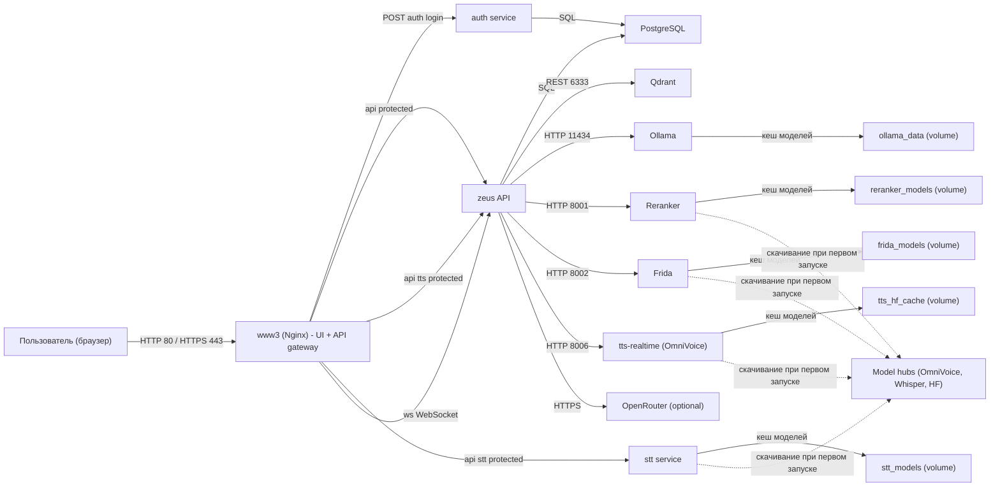
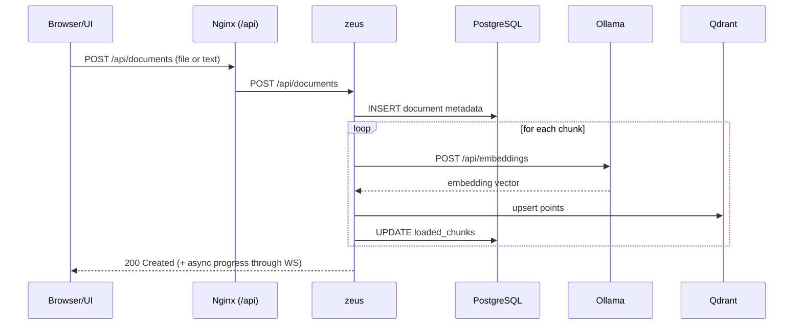
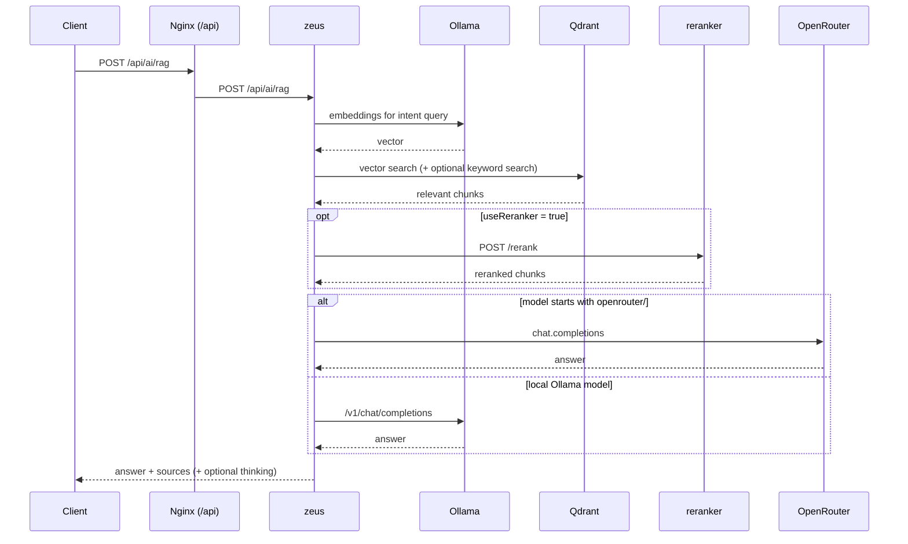

# Архитектура

[English](architecture.md) | **Русский**

## Схема системы

```mermaid
flowchart LR
  user["Пользователь (браузер)"] -->|HTTP 80 / HTTPS 443| nginx["www3 (Nginx) - UI + API gateway"]

  nginx -->|POST auth login| auth["auth service"]
  nginx -->|api protected| zeus["zeus API"]
  nginx -->|api tts protected| zeus
  nginx -->|api stt protected| stt["stt service"]
  nginx -->|ws WebSocket| zeus

  auth -->|SQL| pg["PostgreSQL"]
  zeus -->|SQL| pg
  zeus -->|REST 6333| qdrant["Qdrant"]
  zeus -->|HTTP 11434| ollama["Ollama"]
  zeus -->|HTTP 8001| reranker["Reranker"]
  zeus -->|HTTP 8002| frida["Frida"]
  zeus -->|HTTP 8006| tts["tts-realtime (OmniVoice)"]
  zeus -->|HTTPS| openrouter["OpenRouter (optional)"]

  ollama -->|кеш моделей| ollama_models["ollama_data (volume)"]
  tts -->|кеш моделей| tts_models["tts_hf_cache (volume)"]
  stt -->|кеш моделей| stt_models["stt_models (volume)"]
  reranker -->|кеш моделей| reranker_models["reranker_models (volume)"]
  frida -->|кеш моделей| frida_models["frida_models (volume)"]

  tts -.->|скачивание при первом запуске| model_hub["Model hubs (OmniVoice, Whisper, HF)"]
  stt -.->|скачивание при первом запуске| model_hub
  reranker -.->|скачивание при первом запуске| model_hub
  frida -.->|скачивание при первом запуске| model_hub
```

## Общая картина

- `www3` (Nginx) - единая точка входа для UI и `/api` gateway.
- `auth` проверяет JWT / API keys через Nginx `auth_request`.
- `zeus` - основной backend: проекты, документы, RAG, управление моделями, OpenAPI.
- `ollama` - локальный runtime для LLM и embeddings.
- `vector-db` - Qdrant для векторного поиска.
- `db` - PostgreSQL с pgvector; служебные таблицы лежат в схеме `admin`.
- `tts-realtime` - OmniVoice TTS. Наружу он идет через `zeus` и `/api/tts/*`.
- `stt` - Whisper STT. Наружу он идет через `/api/stt/*`.

## Порты по умолчанию

| Сервис | Порт в контейнере | Порт на хосте |
|---|---:|---:|
| www3 (Nginx) | 80 / 443 | 80 / 443 |
| zeus | 80 | internal |
| auth | 80 | internal |
| db (Postgres) | 5432 | internal |
| vector-db (Qdrant) | 6333 | 6333 |
| frida | 8002 | 8002 |
| reranker | 8001 | 8001 |
| tts-realtime | 8006 | internal |
| stt | 8004 | internal |

## Роутинг gateway

- `POST /auth/login` -> `auth`
- `/api/*` -> `zeus` (authenticated)
- `/api/tts/*` -> `zeus` -> `tts-realtime` (authenticated)
- `/api/stt/*` -> `stt` (authenticated)
- `/api/docs` -> `zeus` (public Swagger UI)

## Ключевые сценарии

### Индексация документов

```mermaid
sequenceDiagram
  participant UI as Browser/UI
  participant GW as Nginx (/api)
  participant Zeus as zeus
  participant PG as PostgreSQL
  participant Ollama as Ollama
  participant Q as Qdrant

  UI->>GW: POST /api/documents (file or text)
  GW->>Zeus: POST /api/documents
  Zeus->>PG: INSERT document metadata
  loop for each chunk
    Zeus->>Ollama: POST /api/embeddings
    Ollama-->>Zeus: embedding vector
    Zeus->>Q: upsert points
    Zeus->>PG: UPDATE loaded_chunks
  end
  Zeus-->>UI: 200 Created (+ async progress through WS)
```

### RAG запрос

```mermaid
sequenceDiagram
  participant Client as Client
  participant GW as Nginx (/api)
  participant Zeus as zeus
  participant Ollama as Ollama
  participant Q as Qdrant
  participant R as reranker
  participant OR as OpenRouter

  Client->>GW: POST /api/ai/rag
  GW->>Zeus: POST /api/ai/rag
  Zeus->>Ollama: embeddings for intent query
  Ollama-->>Zeus: vector
  Zeus->>Q: vector search (+ optional keyword search)
  Q-->>Zeus: relevant chunks
  opt useReranker = true
    Zeus->>R: POST /rerank
    R-->>Zeus: reranked chunks
  end
  alt model starts with openrouter/
    Zeus->>OR: chat.completions
    OR-->>Zeus: answer
  else local Ollama model
    Zeus->>Ollama: /v1/chat/completions
    Ollama-->>Zeus: answer
  end
  Zeus-->>Client: answer + sources (+ optional thinking)
```
